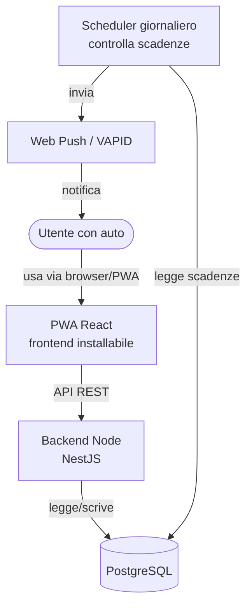

# Cardue

PWA per tenere sotto controllo le scadenze e la manutenzione della propria auto:
bollo, assicurazione, revisione, tagliando e altri interventi periodici, con
promemoria automatici prima di ogni scadenza.

Progetto personale, open source e non profit. Lo scopo è uno solo: **non
dimenticare più una scadenza dell'auto**.

---

## 🤖 Scritto da Claude Code

Tutto il codice di questo repository — backend, frontend, configurazione, test e
documentazione — è **scritto da [Claude Code](https://claude.com/claude-code)**,
l'assistente di programmazione di Anthropic.

Il ruolo umano è quello di committente e revisore: definire cosa deve fare
l'applicazione, decidere fra le alternative proposte e verificare il risultato.
Il ruolo di Claude Code è tradurre quelle scelte in codice funzionante e
documentarne le ragioni.

Le decisioni architetturali, con le alternative valutate e i costi accettati,
sono tracciate negli [Architecture Decision Records](docs/adr/README.md): sono il
posto in cui leggere *perché* il progetto è fatto così.

---

## ⚠️ Disclaimer

Le informazioni su scadenze, intervalli di manutenzione e interventi consigliati
hanno **carattere puramente indicativo**. Non sostituiscono il libretto di uso e
manutenzione del veicolo, il meccanico o le fonti ufficiali. Gli autori **non si
assumono alcuna responsabilità** per errori, omissioni o decisioni prese sulla
base dei dati mostrati dall'applicazione. Verifica sempre le scadenze presso le
fonti ufficiali.

---

## Funzionalità previste

- Anagrafica dei propri veicoli (marca, modello, anno, targa…)
- Scadenze per veicolo: bollo, assicurazione, revisione, tagliando
- Promemoria automatici via notifica push prima di ogni scadenza
- Database di conoscenza marca → modello con gli intervalli tipici di manutenzione
- Possibilità per gli utenti di richiedere nuovi veicoli non presenti
- Possibilità per gli utenti di contribuire con informazioni su un veicolo
- Funzione per mettere in pausa/tracciare la sospensione dell'assicurazione

## Stack tecnico

| Livello    | Tecnologia (proposta)          |
|------------|--------------------------------|
| Frontend   | React + Vite (PWA installabile)|
| Backend    | Node.js (NestJS)               |
| Database   | PostgreSQL                     |
| Notifiche  | Web Push (VAPID) + scheduler   |
| Deploy     | VPS Aruba + Docker Compose     |
| CI/CD      | GitHub Actions                 |

Le scelte tecniche e le motivazioni sono documentate negli
[Architecture Decision Records](docs/adr/README.md).

Il criterio che le guida è la **longevità**: un progetto personale mantenuto da
una persona sola deve poter restare fermo per mesi e ripartire senza sorprese.
Da qui la preferenza per poche dipendenze, strumenti con documentazione solida e
soluzioni introdotte quando servono, non prima.

## Architettura

## Licenza

Questo progetto è rilasciato sotto la [MIT License](LICENSE.md).
